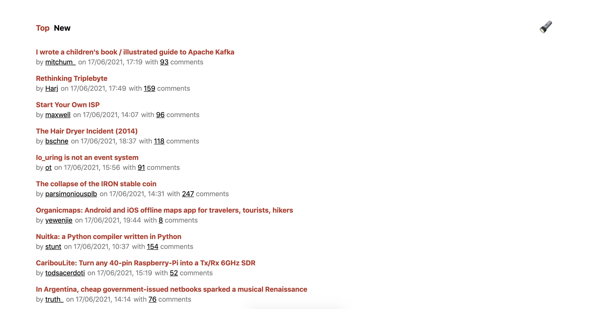

<h2 align="center">Hacker News Clone React</h2>

This project is a clone of hacker news built using React and TypeScript. It has two modes: light and dark.

  

  <a href="https://hacker-news-xin.netlify.app/">Live Demo</a>

### Featuring

- React - (UI Framework)
- Next - (Routing, Build tool uses Webpack)
- TypeScript - (Static Types)
- Webpack - (Module Bundler)

## How To Run

Running the app in dev mode:

`npm install`

`npm start`

To run in production mode:

`npm run build && npm run start`
